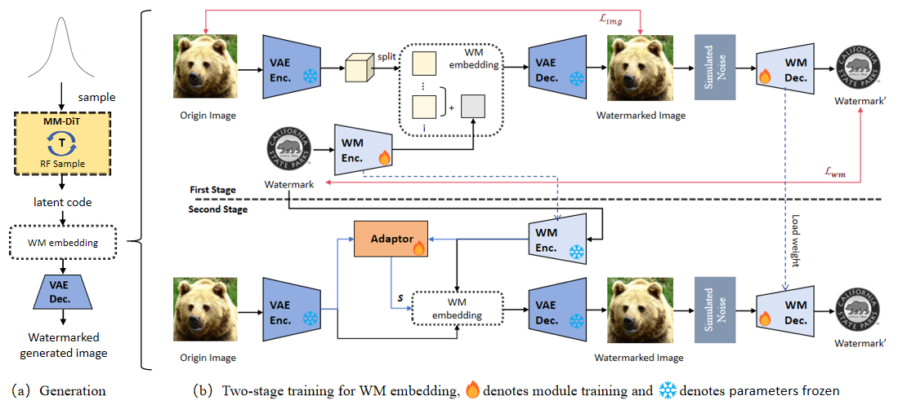

# Robust Watermarking with Latent Adapter on Rectified Flow Models

## Project Overview

This project implements a robust watermarking system for Stable Diffusion 3.

---

## System Architecture

### Overall framework

<p align="left">
  
</p>

---

## Usage

### Data Preparation

**Training Data**
   - Training set: `train/dataset/train/`
   - Validation set: `train/dataset/val/`

### Phase 1 Training

Train watermark encoder and decoder.
```bash
cd train/src
python phase1.py --data_dir ../dataset/train --output_dir ../result/stage1 \
```

**Output**:
- Model checkpoints saved in `output_dir`
- Training process image comparisons saved in `output_dir/generate/`
- Extracted watermarks saved in `output_dir/watermark/`

### Phase 2 Fine-tuning

Train adapter network and fine-tune watermark decoder.
```bash
cd train/src
python phase2.py --data_dir ../dataset/train --output_dir ../result/stage2 --wm_model_path ../result/stage1/wm_encoder_decoder.ckpt \
```

**Output**:
- Adapter model: `output_dir/adaptor_best.ckpt`
- Complete model: `output_dir/wm_encoder_decoder_best.ckpt`
- VAE decoder: `output_dir/vae_decoder_best.ckpt`

### Generation

Use trained models to add watermarks to generated images.

**Config File**: `generation/config/config_list_adaptor.yaml`
```bash
cd generation
python generate.py
```

**Output**:
- Original generation: `save_img/generate/`
- Watermarked images: `save_img/marked/`
- Extracted watermarks: `save_img/watermark/`
- Metrics: `save_img/results.csv` (includes PSNR, SSIM, NC)

### Attack Testing

Test watermark robustness against various attacks.

**Types**:
- `diff_attacker`: Diffusion model attack (60 steps)
- `jpeg_attacker`: JPEG compression (quality 10)
- `brightness`: Brightness adjustment (0.5)
- `contrast`: Contrast adjustment (0.5)
- `Gaussian_noise`: Gaussian noise (std=0.05)
- `Gaussian_blur`: Gaussian blur (kernel size 9)
- `bm3d`: BM3D denoising
- `crop`: Cropping attack (0.5)

```bash
cd test
python attack_pipeline.py --output_path ./example/save_img \
```

**Output**:
- Attacked images: `output_path/attack/{attack_name}/`
- Attack results: `output_path/attack_results.txt` (includes NC values for each attack)